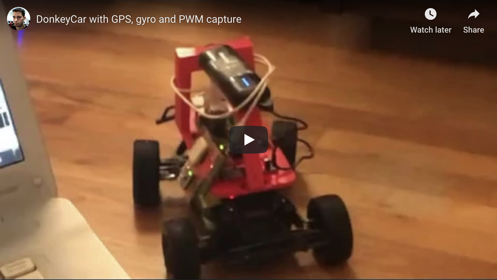

# Donkeycar


## Video

[](https://www.youtube.com/watch?v=y7wChCVcuVY)

## How to

```
ssh pi@192.168.1.124
```

If it's on `Ellipsis Jetpack 15BF`:

```
ssh pi@192.168.1.11
```


Wifi notes: Setting WiFi up via the command line
https://www.raspberrypi.org/documentation/configuration/wireless/wireless-cli.md


Ellipsis Jetpack 15BF


```
$ python a.py
```

This was a good attempt - but didn't work:

```
./usbrawserial /dev/ttyACM0
```


[Ref](http://docs.donkeycar.com/guide/get_driving/):
```
$ cd ~/mycar/
$ python manage.py drive
```

http://192.168.1.124:8887
http://192.168.1.11:8887


## References

* [Pulse Width Modulation](https://learn.sparkfun.com/tutorials/pulse-width-modulation/all)
* [Arduino Uno SMD](https://www.arduino.cc/en/Main/ArduinoBoardUnoSMD)
* [SPI library](https://www.arduino.cc/en/reference/SPI)
* [Three Ways To Read A PWM Signal With Arduino](http://www.benripley.com/diy/arduino/three-ways-to-read-a-pwm-signal-with-arduino/)
* [MPU-6000 and MPU-6050 Register Map and Descriptions](https://www.invensense.com/wp-content/uploads/2015/02/MPU-6000-Register-Map1.pdf)
* [MPU-6000 and MPU-6050 Product Specification](https://store.invensense.com/datasheets/invensense/MPU-6050_DataSheet_V3%204.pdf)
* [MPU-6050 Accelerometer + Gyro](https://playground.arduino.cc/Main/MPU-6050/#short)
* [USB-ISS  Multifunction USB Communications Module - I2C Mode](https://www.robot-electronics.co.uk/htm/usb_iss_i2c_tech.htm)
* [USB-ISS  Multifunction USB Communications Module - I/O Mode](https://www.robot-electronics.co.uk/htm/usb_iss_io_tech.htm)
* [How to use the accelerometer- gyroscope GY-521](https://create.arduino.cc/projecthub/Nicholas_N/how-to-use-the-accelerometer-gyroscope-gy-521-6dfc19)
* [SparkFun FTDI Basic Breakout - 3.3V](https://www.sparkfun.com/products/9873)
* [pyserial/serial/serialposix.py](https://github.com/pyserial/pyserial/blob/master/serial/serialposix.py)
* [Make Raspberry Pi and Arduino Work as One Team](https://www.sunfounder.com/blog/rpi-ard/)
* [Interface a Raspberry Pi with an Arduino so the two boards can communicate with one another](https://maker.pro/raspberry-pi/tutorial/how-to-connect-and-interface-raspberry-pi-with-arduino)
* [TinyGPSPlus/examples/DeviceExample/DeviceExample.ino](https://github.com/mikalhart/TinyGPSPlus/blob/master/examples/DeviceExample/DeviceExample.ino)
* [LS20031 5Hz (66 Channel) GPS Receiver Hookup Guide](https://learn.sparkfun.com/tutorials/ls20031-5hz-66-channel-gps-receiver-hookup-guide/all)
