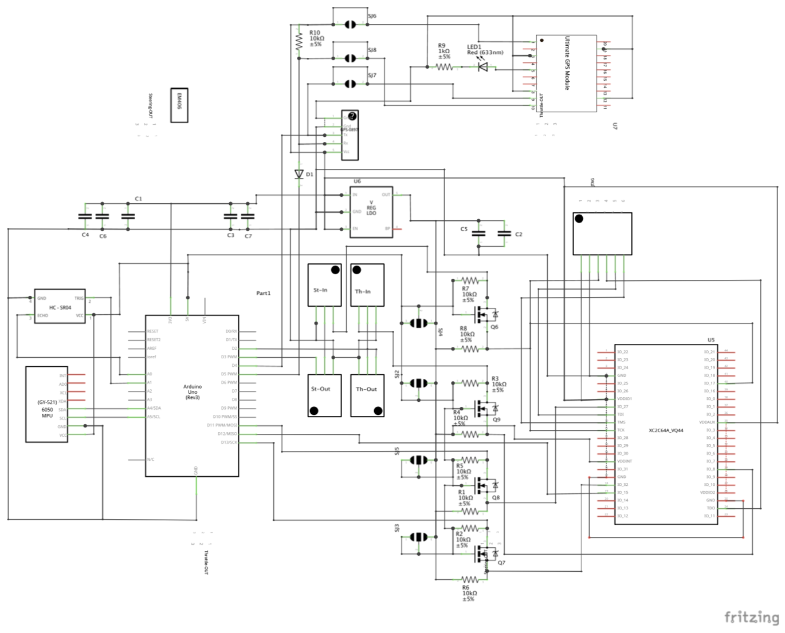
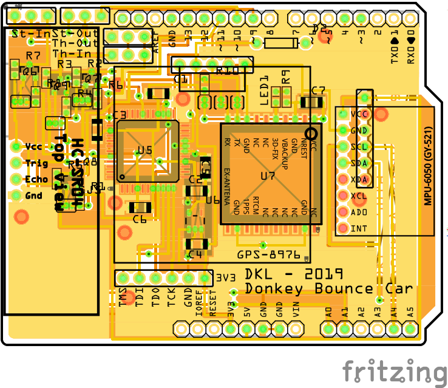
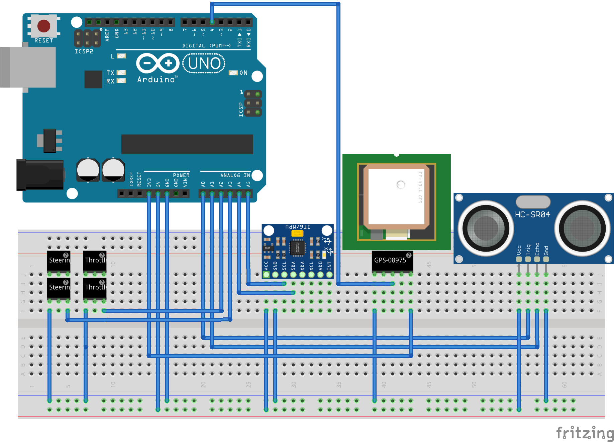
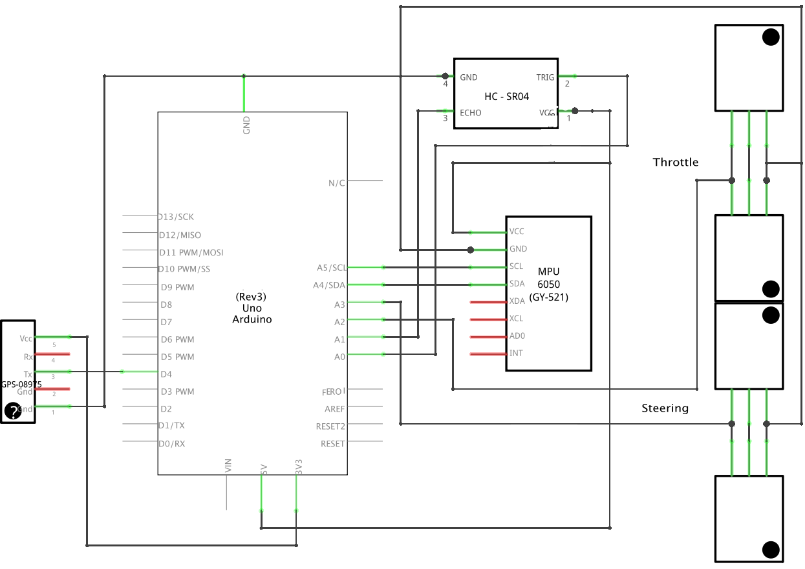
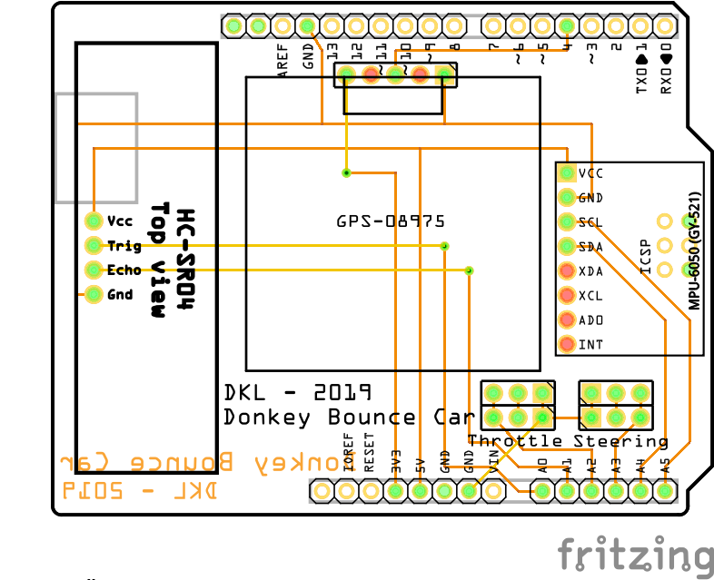

# Donkey Bounce Car
The Donkey Bounce Car is the [Donkey Car](https://www.donkeycar.com/) + super fancy extra hardware and software.

## Video

[](https://www.youtube.com/watch?v=y7wChCVcuVY)

## Donkey Bounce Shield II

### Goal
The second version of the Donkey Bounce Shield, uses a CPLD to accuratelly measure Servo signals from the Remote Control (RC). It creates PWM signals that drive both steering and throttle and by default it mirrors the signals of the RC. Alternatively, Arduino's serial port can override RC settings and drive the car. It also now supports various types of GPSs and both 6-axis and 9-axis absolute position sensors.

* You can find the PCB [here](https://oshpark.com/shared_projects/81d3538F).
* You can find the CPLD design and JTAG files [here](shield/servo-reader-xc2c64a).
* You can find the latest Arduino Sketch [here](shield/gps-gyro-pwm).
* You can find the updated ServoTimer1 library [here](shield/ServoTimer1).

The schematic



The Shield



### Rationale

As soon as I started using the first version of the Donkey Bounce Shield, several limitations became aparent:

1. Measuring the value of Servo, created by the Remote Control, was highly inaccurate. Even after using interrupts and any other technique the accuracy was bad.
2. I could create PWM signals but I would have to manually unplug the Remote Control, when using them.
3. When, after several modifications I was able to have arduino as man-in-the-middle, Donkey Car was making random small moves as inaccurate measurements where propagated to the PWM controller.

The reason for inaccurate measurmeents was the sensitivity on interrupts. More specifically the `cli` command stops interrupts and it's used very often. For example, it's used by the `micros()` Arduino command and it's also very heavily used by the SoftwareSerial module. We need that module in order to read GPS signals.

Bottom line; In order to accurately read PWM signals you need to measure latencies with microsecond-level precision and an Arduino can't do that when it's as busy as it is in our case. I offloaded this work to [custom hardware and more specifically an XC2C64A Xilinx CPLD](servo-reader-xc2c64a).

### References

* [Use the Matrix Glitcher as a Coolrunner II XC2C64A development board](http://blog.dimitrioskouzisloukas.com/2019/08/use-matrix-glitcher-as-coolrunner-ii.html)
* [XC2C64A CoolRunner-II CPLD Datasheet](https://www.xilinx.com/support/documentation/data_sheets/ds311.pdf)
* [Datasheet of GPS smart antenna module, LS20030~3](https://cdn.sparkfun.com/datasheets/GPS/LS20030~3_datasheet_v1.3.pdf)
* [FGPMMOPA6H GPS Standalone Module Data Sheet](https://cdn-shop.adafruit.com/datasheets/GlobalTop-FGPMMOPA6H-Datasheet-V0A.pdf)
* [Adafruit Ultimate GPS v3 Schematic](https://learn.adafruit.com/adafruit-ultimate-gps/downloads)
* [Dangerous Prototypes XC2C64A cpld breakout Schematic](http://dangerousprototypes.com/docs/File:Cct-XC2C_64a-cpld-breakout-v1a.png)
* [TC1014/TC1015/TC1185 Voltage Regulators](http://ww1.microchip.com/downloads/en/devicedoc/21335e.pdf)
* [Logic Level Bidirectional Adaptor Schematic](https://cdn.sparkfun.com/datasheets/BreakoutBoards/Logic_Level_Bidirectional.pdf)
* [5V Tolerance Techniques for CoolRunner-II Devices](https://www.xilinx.com/support/documentation/application_notes/xapp429.pdf)
* [BSS138 N-Channel Logic Level Enhancement Mode Field Effect Transistor](https://cdn.sparkfun.com/datasheets/BreakoutBoards/BSS138.pdf)
* [Adafruit BNO055 Absolute Orientation Sensor](https://learn.adafruit.com/adafruit-bno055-absolute-orientation-sensor?view=all)


## Donkey Bounce Shield I

### What

A shield that adds a GPS, a gyro, PWM monitors and a distance sensor



The schematic



The Shield



You can find details about the PCB [here](https://oshpark.com/shared_projects/IXQhfZmE).


### How to

```
ssh pi@192.168.1.124
```

If it's on `Ellipsis Jetpack 15BF`:

```
ssh pi@192.168.1.11
```


Wifi notes: Setting WiFi up via the command line
https://www.raspberrypi.org/documentation/configuration/wireless/wireless-cli.md


Ellipsis Jetpack 15BF


```
$ python a.py
```

This was a good attempt - but didn't work:

```
./usbrawserial /dev/ttyACM0
```


[Ref](http://docs.donkeycar.com/guide/get_driving/):
```
$ cd ~/mycar/
$ python manage.py drive
```

http://192.168.1.124:8887
http://192.168.1.11:8887

### GPS

* GPS Receiver - LS20031 5Hz ([1](https://www.sparkfun.com/products/8975), [2](https://learn.sparkfun.com/tutorials/ls20031-5hz-66-channel-gps-receiver-hookup-guide?_ga=2.230844831.1449235539.1558239626-1152025920.1554262143), [3](https://cdn.sparkfun.com/datasheets/GPS/LS20030~3_datasheet_v1.3.pdf))

### References

* [Pulse Width Modulation](https://learn.sparkfun.com/tutorials/pulse-width-modulation/all)
* [Arduino Uno SMD](https://www.Uno.cc/en/Main/ArduinoBoardUnoSMD)
* [SPI library](https://www.arduino.cc/en/reference/SPI)
* [Three Ways To Read A PWM Signal With Arduino](http://www.benripley.com/diy/arduino/three-ways-to-read-a-pwm-signal-with-arduino/)
* [MPU-6000 and MPU-6050 Register Map and Descriptions](https://www.invensense.com/wp-content/uploads/2015/02/MPU-6000-Register-Map1.pdf)
* [MPU-6000 and MPU-6050 Product Specification](https://store.invensense.com/datasheets/invensense/MPU-6050_DataSheet_V3%204.pdf)
* [MPU-6050 Accelerometer + Gyro](https://playground.arduino.cc/Main/MPU-6050/#short)
* [USB-ISS  Multifunction USB Communications Module - I2C Mode](https://www.robot-electronics.co.uk/htm/usb_iss_i2c_tech.htm)
* [USB-ISS  Multifunction USB Communications Module - I/O Mode](https://www.robot-electronics.co.uk/htm/usb_iss_io_tech.htm)
* [How to use the accelerometer- gyroscope GY-521](https://create.arduino.cc/projecthub/Nicholas_N/how-to-use-the-accelerometer-gyroscope-gy-521-6dfc19)
* [SparkFun FTDI Basic Breakout - 3.3V](https://www.sparkfun.com/products/9873)
* [pyserial/serial/serialposix.py](https://github.com/pyserial/pyserial/blob/master/serial/serialposix.py)
* [Make Raspberry Pi and Arduino Work as One Team](https://www.sunfounder.com/blog/rpi-ard/)
* [Interface a Raspberry Pi with an Arduino so the two boards can communicate with one another](https://maker.pro/raspberry-pi/tutorial/how-to-connect-and-interface-raspberry-pi-with-arduino)
* [TinyGPSPlus/examples/DeviceExample/DeviceExample.ino](https://github.com/mikalhart/TinyGPSPlus/blob/master/examples/DeviceExample/DeviceExample.ino)
* [LS20031 5Hz (66 Channel) GPS Receiver Hookup Guide](https://learn.sparkfun.com/tutorials/ls20031-5hz-66-channel-gps-receiver-hookup-guide/all)

## Todo

Create a UI using [1](https://sketchfab.com/3d-models/red-dragon-ac2edeb01b9a4d4796c4d34f5d8aa1f2), [2](https://learn.adafruit.com/bno055-absolute-orientation-sensor-with-raspberry-pi-and-beaglebone-black?view=all#software), [3](https://learn.adafruit.com/assets/24667).