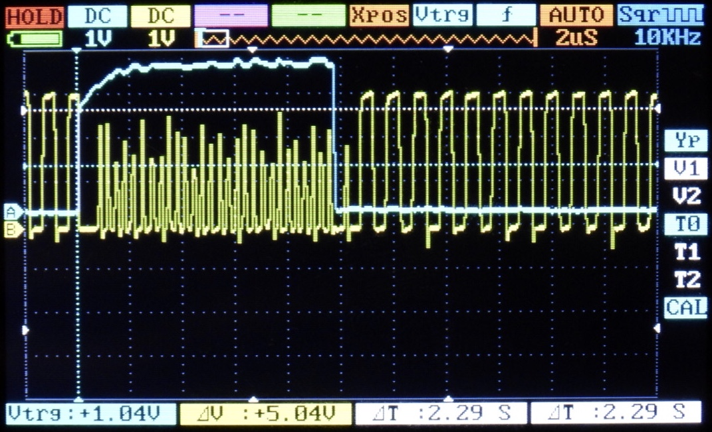

# Servo Reader for XC2C64A-CP56

This is a Verilog design using Xilinx ISE WebPACK. 

## Principles of operation

* Arduino controls the "clock" input of the CPLD. Most of the time it runs in 1MHz, allowing the CPLD to measure Servo signals with microsecond accuracy.
* Servo control pulses get generated 50 times a second.
* 25 times per second the Arduino stops the clock and turns the 'scan enable' input to true. Then it scans out the contents of all registers in the CPLD.

* The fact that measurments take place 25 times per second, means that it's guaranteed that each of the two channels has measured one pulse, since they're created 50 times per second.
* CPLD's registers contain for each of the two channels: a) the 12-bit value of the pulse width measurment (from 0 to 4095 microseconds) b) a two-bit status value which can be in one of the following states: WAIT (Error state - Didn't receive a pulse), RUNNING (Error state - Still measuring), DONE (Success - the 12-bit value is valid), OVERFLOW (Error state - the pulse width was larger than 4095 microseconds).

The CPLD design is very compact. Obviously we need no less than 14 bits per channel, and we use two extra registers for input metastability prevention and edge detection. At the end it's 16 registers per channel. Half of the CPLD is used. It is possible to fit twice as many channels on the same CPLD.

In this folder you will find the following:

## Design

* [servocount1.v](servocount1.v) - Single PWM reader
* [servocount.v](servocount.v) - Top-Level two-channel PWM reader

## Verification

* [servocount_tb.v](servocount_tb.v) - Testbench
* [wave.do](wave.do) - ModelSim simulation layout

## Constraints

* [servocount-cp56.ucf](servocount-cp56.ucf) Constraints for XC2C64A-CP56. It won't work for other package types for the same CPLD

## JTAG files

* [servocount-cp56.jed](servocount-cp56.jed) - JEDEC file for package CP56
* [servocount-cp56.xsvf](servocount-cp56.xsvf) - Scan file for package CP56
